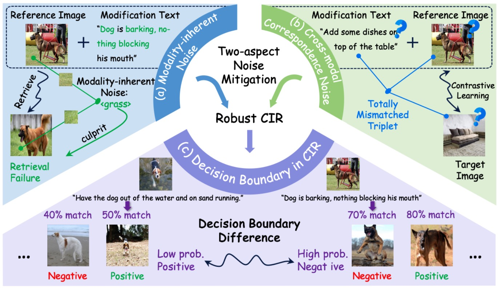
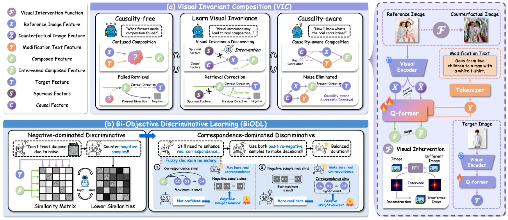
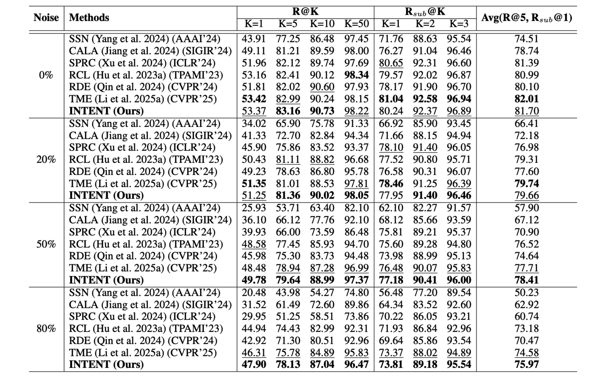
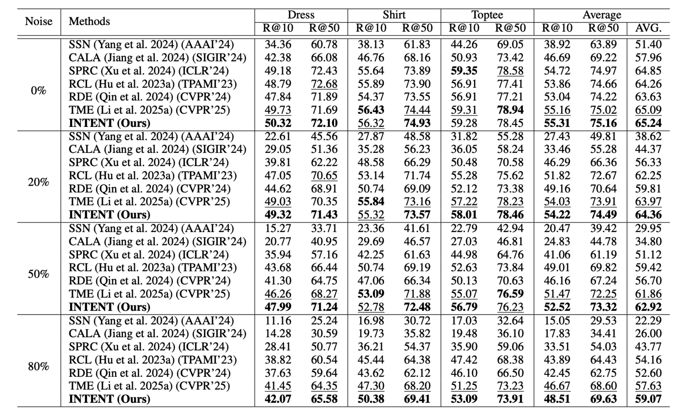
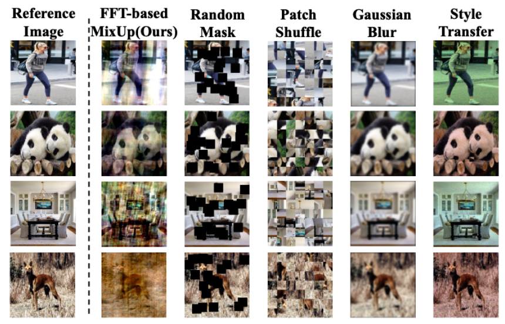

<p align="center">
  <h1 align="center">🚀 (AAAI 2026) INTENT: Invariance and Discrimination-aware Noise Mitigation for Robust Composed Image Retrieval</h1>

  <br> 
  <div align="center">
    
  </div>
  <p align="center">
    <a href="https://arxiv.org/abs/coming soon"></a>
    <a href=""></a>
    <a href="https://github.com/"></a>
  </p>
</p>

## 📌 Introduction
Welcome to the official repository for **INTENT**. This project provides the codebase of our paper, offering a novel approach to Composed Image Retrieval with Noisy Correspondence using BLIP-2 architectures. 

*Disclaimer: This codebase is intended for research purposes.*

## 📰 News and Updates
* **[Mar 2026]** 🚀 We have officially released the training and testing code for INTENT!
* **[Nov 2025]** ⏳ INTENT is accepted by AAAI 2026.

---
### INTENT Pipeline (based on [LAVIS](https://github.com/chiangsonw/cala?tab=readme-ov-file))


## 📂 Project Structure
To help you navigate our codebase quickly, here is an overview of the main components:

```text
├── lavis/                 # Core model directory (built upon LAVIS)
│   └── models/
│       └── blip2_models/
│           └── blip2_cir.py   # 🧠 The core INTENT model implementation.
├── train_INTENT.py        # 🚂 Main training script
├── test.py                # 🧪 General evaluation script
├── cirr_sub_BLIP2.py      # 📤 Script to generate submission files for the CIRR dataset
├── datasets.py            # 📊 Data loading and processing utilities
└── utils.py               # 🛠️ Helper functions (logging, metrics, etc.)
```

## 🛠️ Installation & Setup
We recommend running this code on a Linux system with an NVIDIA GPU.
### 1. Clone the repository
```
git clone https://github.com/ZivChen-Ty/INTENT.git
cd INTENT
```
### 2. Create a virtual environment
```
conda create -n intent_env python=3.9
conda activate intent_env
```
### 3. Install dependencies
```
pip install -r requirements.txt
```

## 💾 Data Preparation
Before training or testing, you need to download and structure the datasets.

Download the CIRR / FashionIQ dataset from [CIRR official repo](https://github.com/Cuberick-Orion/CIRR) and [FashionIQ official repo](https://github.com/XiaoxiaoGuo/fashion-iq).

Organize the data as follows:


#### 1) FashionIQ:
```
├── FashionIQ
│   ├── captions
|   |   ├── cap.dress.[train | val].json
|   |   ├── cap.toptee.[train | val].json
|   |   ├── cap.shirt.[train | val].json

│   ├── image_splits
|   |   ├── split.dress.[train | val | test].json
|   |   ├── split.toptee.[train | val | test].json
|   |   ├── split.shirt.[train | val | test].json

│   ├── dress
|   |   ├── [B000ALGQSY.jpg | B000AY2892.jpg | B000AYI3L4.jpg |...]

│   ├── shirt
|   |   ├── [B00006M009.jpg | B00006M00B.jpg | B00006M6IH.jpg | ...]

│   ├── toptee
|   |   ├── [B0000DZQD6.jpg | B000A33FTU.jpg | B000AS2OVA.jpg | ...]
```
#### 2) CIRR:
```
├── CIRR
│   ├── train
|   |   ├── [0 | 1 | 2 | ...]
|   |   |   ├── [train-10108-0-img0.png | train-10108-0-img1.png | ...]

│   ├── dev
|   |   ├── [dev-0-0-img0.png | dev-0-0-img1.png | ...]

│   ├── test1
|   |   ├── [test1-0-0-img0.png | test1-0-0-img1.png | ...]

│   ├── cirr
|   |   ├── captions
|   |   |   ├── cap.rc2.[train | val | test1].json
|   |   ├── image_splits
|   |   |   ├── split.rc2.[train | val | test1].json
```
*(Note: Please modify datasets.py if your local data paths differ from the default setup.)*

## 🚀 Quick Start: Run INTENT
### 1. Training & Evaluating the Model
To train the INTENT model from scratch, use the train_INTENT.py script. You can specify hyperparameters via command line arguments or a config file.
```
python train_INTENT.py
```
And the evaluation process is included.
*(Tip: Check out utils.py for logging details during training. Checkpoints will be automatically saved.)*
### 2. Generating Submissions (CIRR Dataset)
If you are evaluating on the [CIRR test server](https://cirr.cecs.anu.edu.au), we provide a dedicated script to generate the required JSON submission files.
```
python cirr_sub_BLIP2.py \
  --checkpoint_path ./checkpoints/intent_run/best_model.pth \
  --output_file ./submission.json
```

## 🏃‍♂️ Experiment Results
### CIR Task Performance
#### CIRR：

#### FIQ:

### Image Intervention


## 📝 Citation
If you find our work or this code useful in your research, please consider leaving a star or citing our paper 🥰:
```
@inproceedings{INTENT,
  title={INTENT: Invariance and Discrimination-aware Noise Mitigation for Robust Composed Image Retrieval},
  author={Chen, Zhiwei and Hu, Yupeng and Fu, Zhiheng and Li, Zixu and Huang, Jiale and Huang, Qinlei and Wei, Yinwei},
  booktitle={Proceedings of the AAAI Conference on Artificial Intelligence},
  year={2026}
}
```

## 🙏 Acknowledgements
This codebase is heavily inspired by and built upon the excellent [Salesforce LAVIS](https://github.com/chiangsonw/cala?tab=readme-ov-file), [SPRC](https://github.com/chunmeifeng/SPRC) and [TME](https://github.com/He-Changhao/2025-CVPR-TME) library. We thank the authors for their open-source contributions.

## ✉️ Contact
For any questions, issues, or feedback, please open an issue on GitHub or reach out to me at zivczw@gmail.com.
